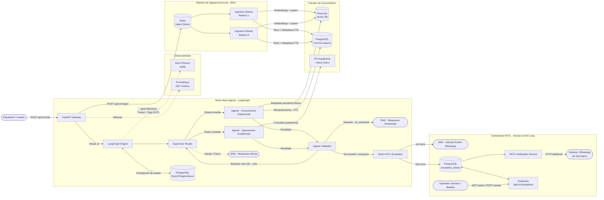

# Sistema Intelligence Universitario · Arquitectura de Producción

Sistema conversacional multi-agente de grado de producción diseñado para la atención académica e institucional universitaria. La arquitectura está orquestada sobre **LangGraph** mediante un patrón de **Supervisor jerárquico** que rutea con Structured Output estricto (Pydantic v2) hacia especialistas desacoplados: un **Knowledge Agent** respaldado por un pipeline de **RAG Híbrido** (búsqueda vectorial en Pinecone + Full-Text Search en PostgreSQL con ranking `ts_rank_cd`), y un **Academic Agent** con invocación determinista de herramientas (*Tool Calling* tipado). Para garantizar fiabilidad, el sistema desacopla el ruteo de la evaluación mediante un **Agente Validador** independiente que audita la suficiencia de la evidencia y mitiga alucinaciones antes de responder. La persistencia conversacional multi-turno y la tolerancia a fallos se implementan con un **Checkpointer asíncrono en PostgreSQL (`AsyncPostgresSaver`)** por `thread_id`. Ante consultas no resueltas, el sistema activa un protocolo **HOTL (Human-on-the-Loop)** en dos turnos conversacionales que captura datos de contacto en lenguaje natural, genera tickets auditables y emite webhooks asíncronos. La plataforma opera bajo **Clean Architecture** en **Python 3.12**, con instrumentación completa de **OpenTelemetry / OpenInference** exportada a **Arize Phoenix** para observabilidad de spans, latencia, consumo de tokens y costos por modelo.

---

## 1. Arquitectura y Principios de Diseño

El sistema está estructurado bajo **Clean Architecture** y principios **SOLID**, garantizando bajo acoplamiento, alta cohesión y testeabilidad total sin efectos colaterales globales.

```text
proyecto/
├── app/
│   ├── core/                  # Infraestructura base: config, logging, telemetry, rate limiting, métricas, seguridad y resiliencia
│   ├── domain/                # Capa de dominio: enums de estado, roles, canales y protocolos abstractos
│   ├── schemas/               # Contratos Pydantic v2: DTOs para chat, streaming, ingesta, prompts, escalamiento y salud
│   ├── db/                    # Persistencia: SQLAlchemy async (asyncpg), modelos ORM e índices FTS, checkpointer LangGraph (psycopg 3)
│   ├── services/              # Casos de uso: RAG híbrido, ingesta documental, worker desacoplado, cliente académico, HOTL y notificaciones
│   ├── agents/                # Grafo LangGraph: supervisor router, agentes especializados (Knowledge, Academic, Validator, Escalation) y tools
│   └── api/                   # FastAPI REST Gateway: routers v1, inyección de dependencias, middlewares y exception handlers
├── data/                      # Almacenamiento local persistente: uploads temporales, prompts sembrados y datasets de evaluación
├── scripts/                   # Scripts de inicialización de base de datos (init_db) y evaluación LLM-as-judge (evaluate_rag)
├── screenshots/               # Evidencias visuales: capturas de trazas en Arize Phoenix y monitoreo
├── tests/                     # Suite de pruebas automatizadas unitarias, de integración, seguridad, concurrencia y métricas
├── Dockerfile                 # Contenedor optimizado multi-stage con usuario no-root
├── docker-compose.yml         # Orquestación de servicios (FastAPI, Redis, PostgreSQL, Worker escalable y Phoenix opcional)
├── pyproject.toml             # Configuración unificada de herramientas de desarrollo (ruff, mypy, pytest)
├── requirements.txt           # Dependencias fijadas para el entorno de producción
├── run.sh                     # Script de arranque rápido para Linux
└── README.md                  # Documentación técnica exhaustiva
```

---

## 2. Diagrama del Sistema Multi-Agente y HOTL



---

## 3. Características Técnicas Principales

### 3.1. Retrieval Híbrido Distribuido (PostgreSQL FTS + Pinecone)
- **Desacoplamiento de la Capa de Aplicación**: La búsqueda léxica se delega directamente al motor de PostgreSQL mediante `to_tsvector('spanish', text)`, `plainto_tsquery('spanish', query)` y ranking de densidad por proximidad con `ts_rank_cd`, respaldado por un índice `GIN` en la tabla `document_chunks`. Esto permite que todas las réplicas de la API compartan el mismo índice léxico centralizado sin necesidad de mantener índices locales por proceso ni desplegar motores dedicados adicionales (como Elasticsearch), simplificando la infraestructura y el escalado horizontal.
- **Fusión Ponderada Asíncrona**: Combina los resultados densos de Pinecone con los resultados léxicos de PostgreSQL aplicando los pesos configurables `LEXICAL_WEIGHT` (0.4) y `VECTOR_WEIGHT` (0.6).
- **Multi-Réplica Nativo**: Todas las réplicas de FastAPI consultan el mismo motor FTS central sin requerir sincronización ni consumo de RAM por proceso.

### 3.2. Supervisión HOTL (Human-on-the-Loop) y Notificaciones Desacopladas
- **Flujo No Bloqueante en 2 Turnos**: La IA detecta casos no resueltos o de baja confianza, solicita el contacto (Email o WhatsApp) y emite un ticket administrativo sin bloquear la API con `interrupt()`.
- **Servicio de Notificación vía Webhook**: Integra `HOTLNotificationService`, que dispara un webhook asíncrono con el payload del ticket hacia el sistema de Bedelía/Secretaría sin retrasar la respuesta al usuario.
- **Resolución Humana**: El personal administrativo consulta y resuelve tickets mediante los endpoints `/api/v1/escalations`.

### 3.3. Worker de Ingesta Escalable y Recuperación de Jobs Huérfanos
- **Worker Pool en Docker**: Múltiples réplicas de `ingestion-worker` consumen de forma segura la cola de Redis mediante `blpop` atómico (`docker compose up --scale ingestion-worker=3`).
- **Recuperación Automática de Jobs Caídos**: La función `recover_orphaned_jobs` se ejecuta al arranque y cada 5 minutos, identificando jobs en `PROCESSING` que hayan superado `INGESTION_JOB_TIMEOUT_MINUTES` (15 min). Si no han alcanzado `INGESTION_MAX_RETRIES` (3), los re-encola en estado `PENDING`; de lo contrario, los marca como `FAILED` con mensaje explicativo.

### 3.4. Observabilidad Integral (Arize Phoenix & Prometheus)
- **Trazabilidad OpenTelemetry**: Instrumentación de LangGraph, OpenAI y spans enriquecidos para escalamientos HOTL (`hotl.escalation=true`, `hotl.ticket_id`, etc.) y atributos semánticos de cuota (`llm.provider.rate_limited=true`).
- **Métricas Prometheus (`/metrics`)**: Expone contadores de tráfico HTTP, latencia por percentiles, ejecuciones de agentes, creación de tickets HOTL y procesamiento de jobs de ingesta. Protegido bajo scope `admin` para prevenir exposición pública de metadatos operativos (Information Disclosure).

### 3.5. Mitigación de Prompt Injection (Directa e Indirecta vía RAG)
El contexto documental que retrieval trae de Pinecone/Postgres FTS es dato de terceros (cualquiera con scope `admin` puede haber subido ese documento) y por lo tanto no confiable. Cuatro capas independientes lo mitigan:
- **Hardening explícito en los 5 prompts de agentes** (`app/agents/prompts/defaults/*.md`): cada uno instruye al modelo a tratar el contenido del contexto/mensajes/resultados de herramientas como datos a evaluar, nunca como instrucciones a obedecer.
- **Contexto RAG delimitado y con advertencia inline**: `knowledge_agent_node` inyecta el contexto recuperado dentro de las etiquetas `<contexto_documental>...</contexto_documental>` en un `SystemMessage` separado con una advertencia explícita, en vez de mezclarlo sin marcar en el historial de mensajes.
- **`/ingest` requiere scope `admin`, no `client`**: separa "quién puede escribir en la base documental que alimenta las respuestas de todos los usuarios" de "quién puede chatear" -- si compartieran scope, cualquier usuario final podría envenenar el RAG para el resto de la población.
- **Content-scanner heurístico en la ingesta** (`app/core/prompt_injection_scanner.py`): antes de indexar, el worker escanea el texto extraído en busca de patrones típicos de instrucciones inyectadas (`ignore previous instructions`, `ignora las instrucciones anteriores`, marcadores de rol falsos como `system:`, pedidos de revelar el prompt, etc.) y rechaza el job (`FAILED` con detalle) si encuentra alguno. Es una capa heurística de defensa en profundidad, no una garantía completa -- las dos mitigaciones anteriores (hardening + delimitado) son las que sostienen la seguridad real ante un patrón no cubierto por el scanner.

---

## 4. Guía de Ejecución y Despliegue

### 4.1. Despliegue con Docker Compose (Recomendado)

En un VPS Ubuntu vacío (sin Docker instalado), el script `run.sh` detecta la falta de Docker y lo instala automáticamente junto con Docker Compose, asegurando permisos y configuraciones:

1. Asignar permisos de ejecución e iniciar por primera vez:
   ```bash
   chmod +x run.sh
   ./run.sh
   ```
   *(El script instalará Docker si no está presente, copiará `.env.example` a `.env` y autogenerará `API_KEY_PEPPER` y `BOOTSTRAP_ADMIN_API_KEY`).*

2. Completar las credenciales externas en `.env`:
   - `OPENAI_API_KEY`: Clave de API de OpenAI.
   - `PINECONE_API_KEY`: Clave de API de Pinecone.
   - *(Opcional)* `HOTL_WEBHOOK_URL`: URL del webhook de Secretaría/Bedelía.

3. Iniciar el stack completo:
   ```bash
   ./run.sh --with-phoenix
   ```

4. Para escalar los workers de ingesta documental en paralelo:
   ```bash
   docker compose up --scale ingestion-worker=3 -d
   ```

### 4.2. Ejecución Local Nativa (Desarrollo sin Docker)

1. Crear y activar el entorno virtual con Python 3.12:
   ```bash
   python -m venv .venv
   source .venv/bin/activate  # En Linux
   ```
2. Instalar dependencias:
   ```bash
   pip install -r requirements.txt -r requirements-dev.txt
   ```
3. Inicializar la base de datos y esquemas:
   ```bash
   python -m scripts.init_db
   ```
4. Iniciar la API FastAPI:
   ```bash
   uvicorn app.main:asgi_app --host 0.0.0.0 --port 8000 --reload
   ```
5. En una terminal paralela, iniciar el worker de ingesta:
   ```bash
   python -m app.services.ingestion_worker
   ```

---

## 5. Documentación Interactiva de la API

La API cuenta con documentación autogenerada y detallada:

- **Swagger UI**: [http://localhost:8000/docs](http://localhost:8000/docs)
- **ReDoc**: [http://localhost:8000/redoc](http://localhost:8000/redoc)
- **OpenAPI JSON**: [http://localhost:8000/api/v1/openapi.json](http://localhost:8000/api/v1/openapi.json)

### Catálogo de Endpoints

| Categoría | Método | Ruta | Descripción | Scope Requerido |
|:---|:---|:---|:---|:---|
| **Chat** | `POST` | `/api/v1/chat` | Turno de conversación sincrónico con el grafo multi-agente. | `client` |
| **Chat** | `POST` | `/api/v1/chat/stream` | Conversación en streaming token por token (Server-Sent Events). | `client` |
| **Ingesta** | `POST` | `/api/v1/ingest` | Carga asíncrona de archivos (PDF, DOCX, TXT, MD) para RAG. | `admin` |
| **Ingesta** | `GET` | `/api/v1/ingest/status/{job_id}` | Consulta del estado y progreso de un job de ingesta. | `admin` |
| **Ingesta** | `GET` | `/api/v1/ingest` | Listado paginado y filtrado (`status`, `file_type`) de jobs de ingesta -- incluye los rechazados por el content-scanner. | `admin` |
| **HOTL** | `GET` | `/api/v1/escalations` | Listado paginado y filtrado de tickets HOTL derivados. | `client` |
| **HOTL** | `GET` | `/api/v1/escalations/{ticket_id}` | Detalle completo de un caso derivado y datos de contacto. | `client` |
| **HOTL** | `POST` | `/api/v1/escalations` | Creación programática manual de un ticket de soporte. | `client` |
| **HOTL** | `POST` | `/api/v1/escalations/{ticket_id}/resolve` | Resolución formal del caso por un operador humano. | `admin` |
| **Prompts** | `GET` | `/api/v1/prompts` | Consulta de system prompts vigentes por agente. | `client` |
| **Prompts** | `PUT` | `/api/v1/prompts/{agent_id}` | Actualización en caliente de directivas de agentes. | `admin` |
| **Admin** | `POST` | `/api/v1/admin/api-keys` | Generación de nuevas claves de acceso API (SHA-256 + pepper). | `admin` |
| **Admin** | `GET` | `/api/v1/admin/api-keys` | Listado de claves registradas (sin exponer texto plano ni hash). | `admin` |
| **Admin** | `DELETE` | `/api/v1/admin/api-keys/{key_id}` | Revocación inmediata de una clave de acceso. | `admin` |
| **Salud** | `GET` | `/api/v1/health` | Diagnóstico de salud y chequeo de Postgres, Redis, Pinecone, OpenAI y Phoenix. | *Público* |
| **Métricas** | `GET` | `/metrics` | Exportación de métricas de infraestructura para Prometheus. | `admin` |

---

## 6. Monitoreo y Alertas en Arize Phoenix

Arize Phoenix (`http://localhost:6006`) proporciona observabilidad profunda de cada invocación LLM y herramienta:

### Configuración de Alertas Recomendadas:
1. **Tasa de Escalamiento HOTL**:
   - Crear un evaluador sobre el atributo `hotl.escalation == True`.
   - Alertar si la proporción de tickets HOTL supera el **15%** del total de conversaciones en una ventana de 1 hora (indica vacíos en la base documental institucional).
2. **Alertas de Cuota y Rate Limits**:
   - Filtrar spans con `llm.provider.rate_limited == True` o `error.quota_exceeded == True`.
   - Configurar webhook de alerta inmediata ante respuestas HTTP 429 de OpenAI o Pinecone.
3. **Anomalías de Latencia**:
   - Monitorear la duración de spans en `knowledge_agent.answer` y `validator.decide` cuando superen los 8 segundos.


### 6.1. Evidencias y Capturas de Trazabilidad (`screenshots/`)
Las capturas de pantalla de la consola de Arize Phoenix se organizan en el directorio [`screenshots/`](screenshots/):
* **Árbol de Spans de LangGraph**: Visualización de la jerarquía de ejecución `supervisor` -> especialista -> `validator`.
* **Trazas de RAG Híbrido**: Spans de llamadas concurrentes a Pinecone (búsqueda densa) y PostgreSQL (FTS léxico) con sus latencias y metadatos.
* **Telemetría HOTL**: Spans enriquecidos con atributos de escalamiento (`hotl.escalation=True`, `hotl.ticket_id`).

---

## 7. Suite de Pruebas y Calidad de Código

El repositorio incluye configuración de **Ruff**, **Mypy** y **Pytest** en `pyproject.toml`.

### Ejecutar Pruebas Automatizadas:
```bash
pytest -v
```

### Ejecutar Linters y Verificación Estática:
```bash
# Verificación de estilo, tipos y buenas prácticas con ruff
ruff check app/ tests/ scripts/

# Formateo automático de código
ruff format app/ tests/ scripts/
```

### Ejecución del Evaluador RAG (LLM-as-a-Judge):
```bash
# Ejecutar dentro del contenedor de la API o localmente:
python -m scripts.evaluate_rag
```

---

## 8. Resultados de la Evaluación RAG (Golden Set & RAG Triad)

Para validar objetivamente el comportamiento del pipeline RAG y la fidelidad del `KnowledgeAgent`, se ejecutó el arnés de evaluación automatizado con **LLM-as-a-Judge** ([`scripts/evaluate_rag.py`](scripts/evaluate_rag.py)) contra el conjunto de prueba curado ([`data/golden_set.json`](data/golden_set.json)).

### 8.1. Resumen Ejecutivo de Métricas

* **Tasa de Aprobación**: **10/10 preguntas aprobadas (100% de éxito)** con umbral mínimo $\ge 0.70$.
* **Fidelidad Promedio (*Faithfulness*)**: **1.00 / 1.00** *(cero alucinaciones: todas las afirmaciones provienen estrictamente del contexto recuperado)*.
* **Relevancia Promedio (*Answer Relevance*)**: **1.00 / 1.00** *(respuestas directas, completas y contextualizadas a la pregunta del estudiante)*.
* **Registro de Resultados**: [`data/evaluation_results.json`](data/evaluation_results.json).

### 8.2. Detalle de Preguntas y Evaluación Caso por Caso

| # | Pregunta | Documento(s) Esperado(s) | Fuentes Recuperadas | Faithfulness | Relevance | Estado |
|:---:|:---|:---|:---|:---:|:---:|:---:|
| 1 | ¿Cuáles son los pasos para realizar la baja de matrícula de un alumno? | `reglamento-academico-alumnos.pdf` | `reglamento-academico-alumnos.pdf` | **1.00** | **1.00** | ✅ OK |
| 2 | ¿Cuál es el máximo de materias que se pueden aprobar por equivalencia? | `reglamento-equivalencias.pdf` | `reglamento-equivalencias.pdf` | **1.00** | **1.00** | ✅ OK |
| 3 | ¿Cuánto tardan en aprobar una beca de comedor? | `Becas_de_Comedor.pdf` | `Becas_de_Comedor.pdf` | **1.00** | **1.00** | ✅ OK |
| 4 | ¿Qué tengo que hacer para inscribirme a una carrera online? | `anexo procedimiento inscripcion online carreras.pdf` | `anexo procedimiento...`, `Resolucion_080-12...`, `disp.-n-1053-22...` | **1.00** | **1.00** | ✅ OK |
| 5 | ¿Por quién están integrados los departamentos? | `ESTATUTO_UNCAUS.pdf` | `ESTATUTO_UNCAUS.pdf` | **1.00** | **1.00** | ✅ OK |
| 6 | ¿Hasta qué edad máxima puedo entrar a estudiar? | `Resolucion_080-12_CS-Reglamento_de_Alumnos.pdf` | `ESTATUTO_UNCAUS.pdf`, `Resolucion_080-12...` | **1.00** | **1.00** | ✅ OK |
| 7 | ¿Cuántas carreras a la vez puedo estudiar? | `Resolucion_080-12_CS-Reglamento_de_Alumnos.pdf` | `Resolucion_080-12...`, `gua-para-presentacin...` | **1.00** | **1.00** | ✅ OK |
| 8 | ¿Qué diferencia hay entre ser alumno regular y hacer equivalencias? | `Resolucion_080-12...`, `reglamento-equivalencias.pdf` | `Resolucion_080-12...`, `reglamento-equivalencias.pdf` | **1.00** | **1.00** | ✅ OK |
| 9 | ¿Qué diferencia hay entre sacar una beca de comedor y un ticket de comedor? | `Becas_de_Comedor.pdf`, `Tickets_de_comedor.pdf` | `Becas_de_Comedor.pdf`, `Tickets_de_comedor.pdf` | **1.00** | **1.00** | ✅ OK |
| 10 | ¿Tengo que pagar para dejar la moto en el estacionamiento de la facultad? | *(Ninguno - Fuera de dominio)* | *(Sin fuentes institucionales relevantes)* | **1.00** | **1.00** | ✅ OK |

### 8.3. Hallazgos y Análisis Cualitativo

1. **Exactitud de Hechos y Límites Normativos**:
   * En la consulta de *equivalencias*, el sistema extrajo con precisión quirúrgica el límite del **50%** y las causales de excepción reglamentarias.
   * En la consulta de *becas de comedor*, diferenció con exactitud los dos plazos administrativos: dictamen de comisión (hasta 2 meses) y notificación rectoral (**7 días**).
2. **Síntesis Multidocumental y Comparativa**:
   * En las preguntas de comparación (regularidad vs equivalencias y beca vs ticket de comedor), el pipeline recuperó fragmentos de dos reglamentos diferentes y redactó respuestas comparativas estructuradas sin mezclar las condiciones ni las normativas.
3. **Mecanismo Anti-Alucinación (Out-of-Domain)**:
   * En la consulta sobre el *estacionamiento de motos*, al no existir información en el corpus documental cargado, el agente respondió honestamente: *"No se encontró información específica sobre el pago para estacionar motos en la facultad en el contexto recuperado"*, alcanzando **1.00 en Faithfulness** y previniendo la invención de normativas inexistentes.
