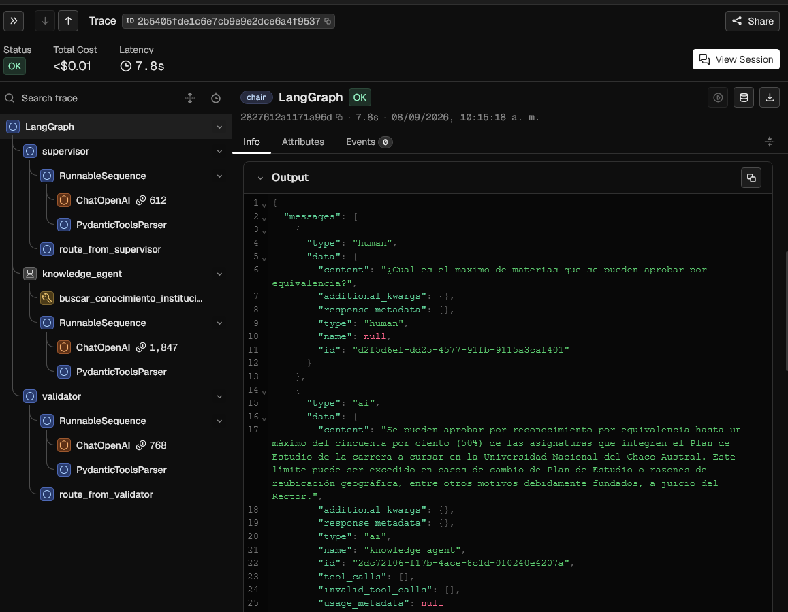
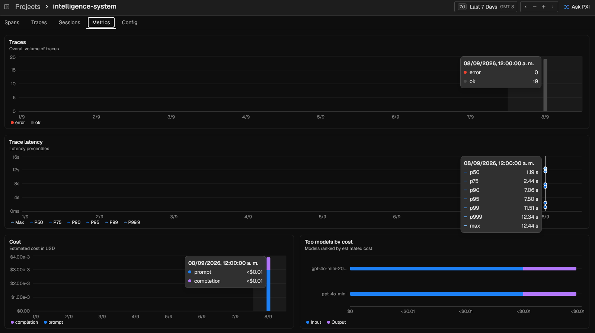
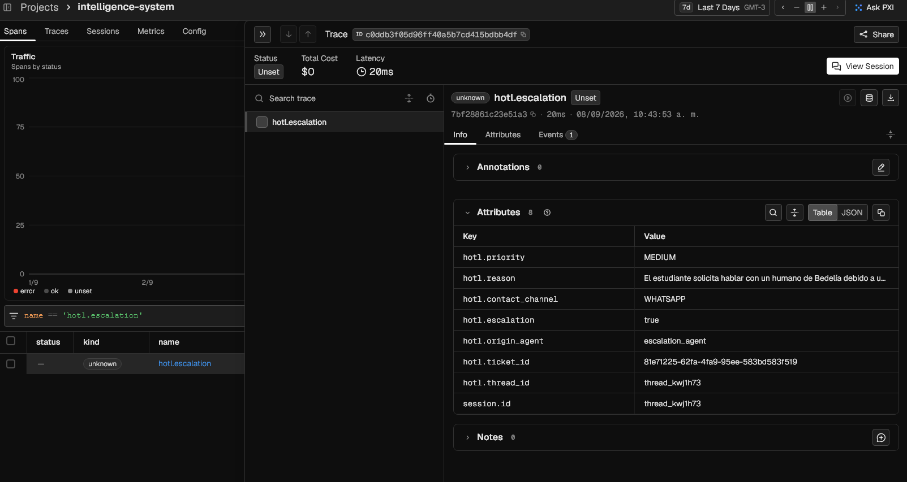
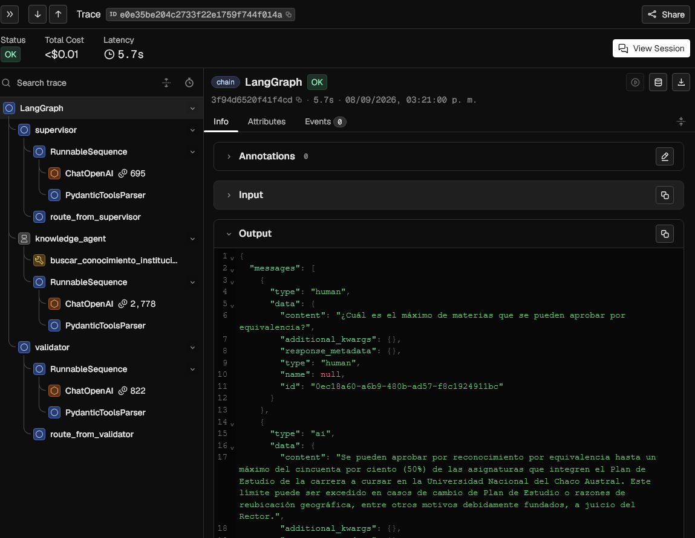
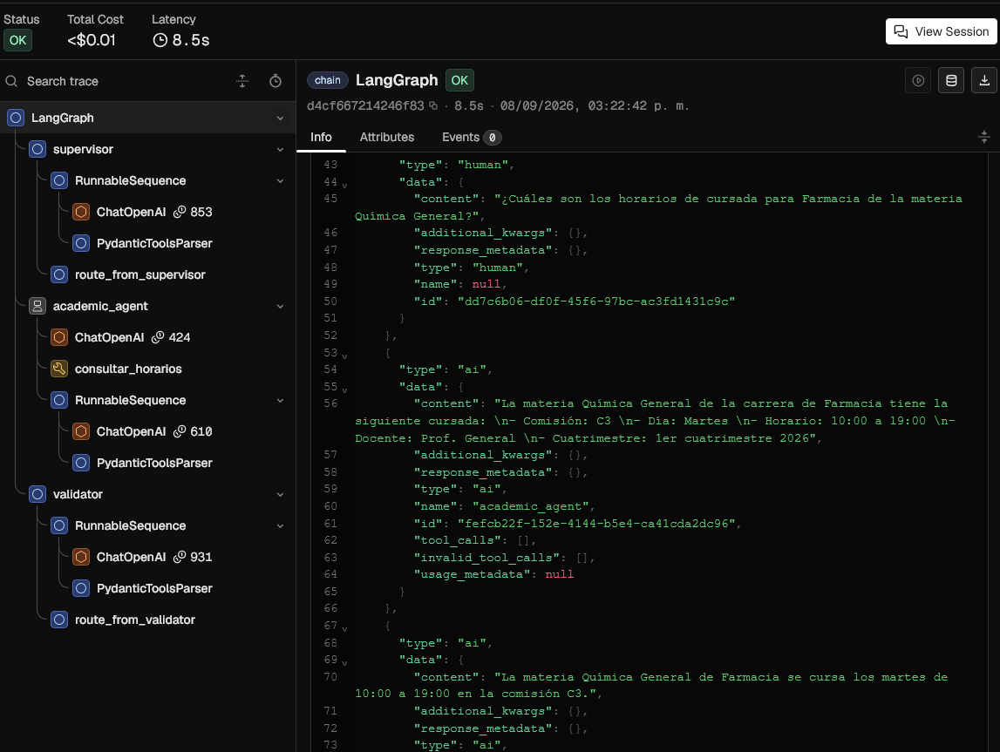
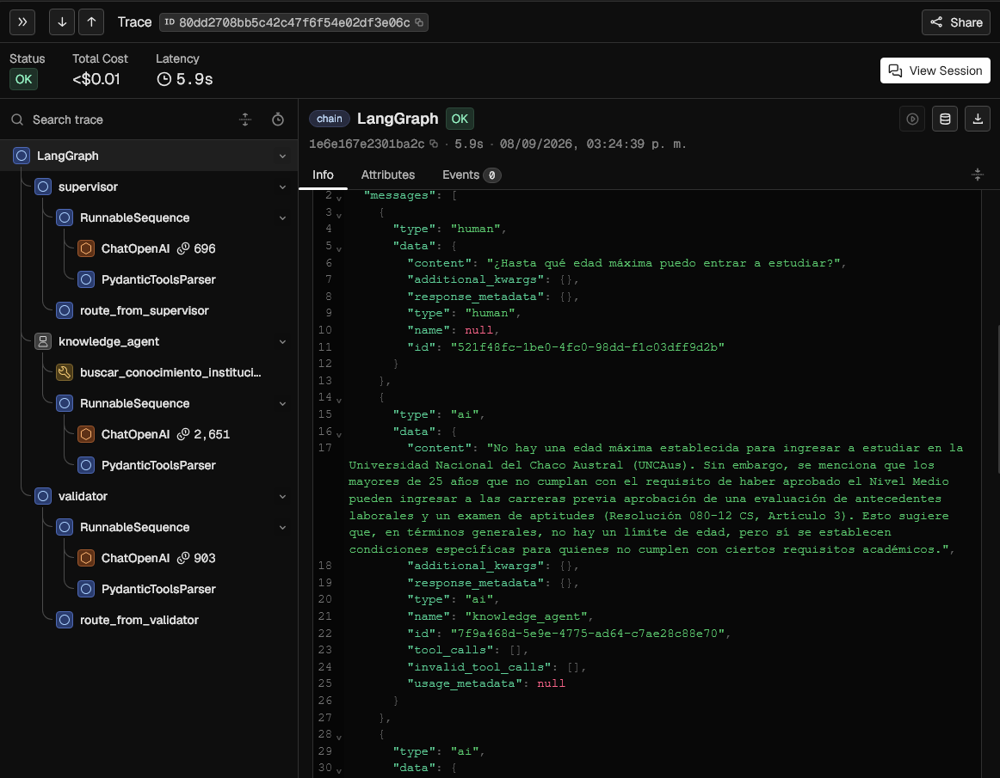

# Evidencias de Observabilidad y Telemetría · Arize Phoenix

En este directorio se documentan las capturas de pantalla obtenidas de la consola de observabilidad **Arize Phoenix**, conectada al backend mediante instrumentación **OpenTelemetry** y **OpenInference** (`openinference-instrumentation-langchain` y `openinference-instrumentation-openai`).

---

## 1. Trazas del Grafo Multi-Agente (LangGraph, Especialistas y RAG)

* **Archivo:** [`01_phoenix_traces_langgraph.png`](01_phoenix_traces_langgraph.png)
* **Consulta Evaluada:** *"¿Cuál es el máximo de materias que se pueden aprobar por equivalencia?"*
* **Trace ID:** `2b5405fde1c6e7cb9e9e2dce6a4f9537`
* **Estado:** `OK` | **Latencia:** `7.8s` | **Costo Estimado:** `<$0.01`

### Desglose del Árbol de Spans de Ejecución:
1. **`LangGraph` (Root Chain):** Orquesta el ciclo de vida de la ejecución del grafo multi-agente con persistencia de estado por `thread_id`.
2. **`supervisor` (Supervisor Router):**
   * Invoca `ChatOpenAI` (612 tokens) con structured output (`SupervisorDecision`).
   * Rutea la consulta directamente a `knowledge_agent` tras clasificarla como consulta normativa institucional.
3. **`route_from_supervisor`:** Ejecuta la arista condicional hacia el especialista correspondiente.
4. **`knowledge_agent` (Agente de Conocimiento):**
   * **`buscar_conocimiento_institucional`:** Dispara el retrieval híbrido concurrente (búsqueda vectorial densa en Pinecone + búsqueda léxica FTS en PostgreSQL con ranking `ts_rank_cd`), recuperando fragmentos de `reglamento-equivalencias.pdf`.
   * **`RunnableSequence` + `ChatOpenAI` (1,847 tokens):** Genera la respuesta delimitada por el contexto recuperado, con nivel de confianza `HIGH` y citas de fuentes.
5. **`validator` (Validador):**
   * Se ejecuta mediante la optimización de transición directa `Agent -> Validator`.
   * Invoca `ChatOpenAI` (768 tokens) con `ValidatorOutput`, confirmando que la información es suficiente (`es_suficiente: true`), con confianza alta y sintetizando la respuesta final.
6. **`route_from_validator`:** Verifica la suficiencia de la respuesta y finaliza la ejecución en `__end__`.
7. **Panel de Salida (`Output` JSON):**
   * Muestra el estado final con la respuesta verificada del 50% de equivalencias, referencias al reglamento, `iteration_count: 1` y `final_answer` lista para el estudiante.

---

## 2. Dashboard de Métricas Operativas (Latencia, Tokens y Rendimiento)

* **Archivo:** [`02_phoenix_metrics_tokens_latency.png`](02_phoenix_metrics_tokens_latency.png)
* **Vista:** Panel de métricas agregadas del proyecto `intelligence-system`.

### Métricas Observadas:
1. **Volumen de Trazas (`Traces`):**
   * **19 trazas registradas** con **100% de éxito operativo** (`error: 0`, `ok: 19`).
2. **Percentiles de Latencia (`Trace latency`):**
   * **p50 (mediana):** `1.19 s` — Respuestas directas del supervisor o consultas simples.
   * **p75:** `2.44 s` — Consultas estándar con retrieval simple.
   * **p90:** `7.06 s` — Consultas con validación completa y síntesis.
   * **p95:** `7.80 s` — Flujo completo (Supervisor + RAG Híbrido + LLM + Validador).
   * **p99 / max:** `11.51 s` / `12.44 s` — Picos asociados a inicializaciones frías de conexiones TLS o parsing de documentos extensos.
3. **Monitoreo de Costos (`Cost`):**
   * Consumo acumulado inferior a `$0.01 USD`, discriminado entre tokens de entrada (*prompt*) y tokens de salida (*completion*).
4. **Distribución por Modelo (`Top models by cost`):**
   * Desglose del consumo entre `gpt-4o-mini-2024-07-18` y `gpt-4o-mini`, reflejando un uso eficiente de tokens mediante extracción estructurada y filtrado contextual.

---

## 3. Telemetría de Escalamiento HOTL (Human-on-the-Loop)

* **Archivo:** [`03_phoenix_hotl_escalation.png`](03_phoenix_hotl_escalation.png)
* **Filtro Aplicado:** `name == 'hotl.escalation'`
* **Span Seleccionado:** `hotl.escalation` (Latencia interna de registro: `20 ms`).

### Atributos Semánticos de Negocio Capturados:
El span implementado en `app/core/tracing_utils.py` mediante `hotl_escalation_span` inyecta automáticamente los metadatos del caso para observabilidad y auditoría administrativa:

| Atributo OpenTelemetry | Valor Capturado en la Traza | Descripción |
| :--- | :--- | :--- |
| **`hotl.escalation`** | `true` | Indicador booleano que permite filtrar y generar alertas automáticas en Phoenix si la tasa de derivación supera el 15%. |
| **`hotl.ticket_id`** | `81e71225-62fa-4fa9-95ee-583bd583f519` | UUID único del ticket persistido en PostgreSQL (`escalation_tickets`). |
| **`hotl.thread_id`** | `thread_kwj1h73` | Identificador de la sesión conversacional en la que se produjo la derivación. |
| **`session.id`** | `thread_kwj1h73` | Mapeo estándar de sesión para correlación de trazas en Arize Phoenix. |
| **`hotl.contact_channel`** | `WHATSAPP` | Canal de contacto validado proporcionado por el estudiante. |
| **`hotl.priority`** | `MEDIUM` | Nivel de prioridad asignado según la naturaleza de la consulta. |
| **`hotl.origin_agent`** | `escalation_agent` | Nodo emisor del ticket dentro del grafo LangGraph. |
| **`hotl.reason`** | *"El estudiante solicita hablar con un humano de Bedelía..."* | Motivo formal de la derivación registrado para el operador humano. |

---

---

## 4. Prueba E2E · RAG Institucional (Knowledge Agent)

* **Archivo:** [`04_trace_rag_knowledge.png`](04_trace_rag_knowledge.png)
* **Consulta Evaluada:** *"¿Cuál es el máximo de materias que se pueden aprobar por equivalencia?"*
* **Trace ID:** `e0e35be204c2733f22e1759f744f014a`
* **Estado:** `OK` | **Latencia:** `5.7 s` | **Costo:** `<$0.01`
* **Tokens Totales:** ~4,295 tokens (`supervisor: 695`, `knowledge_agent: 2,778`, `validator: 822`)

### Desglose del Árbol de Spans:
1. **`supervisor`:** Clasifica la consulta con Structured Output (`SupervisorDecision`), ruteando a `knowledge_agent`.
2. **`route_from_supervisor`:** Condicional de arista ejecutado en <1 ms.
3. **`knowledge_agent`:**
   * Ejecuta `buscar_conocimiento_institucional` sobre el RAG híbrido (Pinecone + PostgreSQL FTS).
   * Genera la respuesta citando la normativa de equivalencias (`reglamento-equivalencias.pdf`).
4. **`validator`:** Audita suficiencia y veracidad (`es_suficiente: true`), sintetizando la respuesta final del 50%.
5. **`route_from_validator`:** Concluye exitosamente en `__end__`.

---

## 5. Prueba E2E · Operación Académica con Tool Calling (Academic Agent)

* **Archivo:** [`05_trace_academic_tools.png`](05_trace_academic_tools.png)
* **Consulta Evaluada:** *"¿Cuáles son los horarios de cursada para Farmacia de la materia Química General?"*
* **Trace ID:** `d4cf667214246f83`
* **Estado:** `OK` | **Latencia:** `8.5 s` | **Costo:** `<$0.01`
* **Tokens Totales:** ~2,818 tokens (`supervisor: 853`, `tool_binding: 424`, `academic_synthesis: 610`, `validator: 931`)

### Desglose del Árbol de Spans:
1. **`supervisor`:** Rutea la consulta a `academic_agent` al detectar una necesidad operativa de cursada.
2. **`academic_agent`:**
   * Invoca `ChatOpenAI` con `bind_tools` tipado.
   * Ejecuta la herramienta determinista `consultar_horarios` con argumentos: `{carrera: "Farmacia", materia: "Química General"}`.
   * Procesa los datos devueltos por la tool y sintetiza la comisión C3 (Martes 10:00 a 19:00).
3. **`validator`:** Valida que la respuesta responde con exactitud los datos solicitados y finaliza en `__end__`.

---

## 6. Prueba E2E · Consulta Reglamentaria con Plazos Generales (Knowledge Agent)

* **Archivo:** [`06_trace_rag_deadlines.png`](06_trace_rag_deadlines.png)
* **Consulta Evaluada:** *"¿Hasta qué edad máxima puedo entrar a estudiar?"*
* **Trace ID:** `80dd2708bb5c42c47f6f54e02df3e06c`
* **Estado:** `OK` | **Latencia:** `5.9 s` | **Costo:** `<$0.01`
* **Tokens Totales:** ~4,250 tokens (`supervisor: 696`, `knowledge_agent: 2,651`, `validator: 903`)

### Desglose del Árbol de Spans:
1. **`supervisor`:** Rutea hacia `knowledge_agent`.
2. **`knowledge_agent`:**
   * Recupera fragmentos de la `Resolución 080-12 CS` (Artículo 3).
   * Determina que no existe límite superior de edad y especifica la excepción para mayores de 25 años sin secundario completo.
3. **`validator`:** Confirma que el contexto documental respalda la respuesta y emite la respuesta final verificada.

---

## Resumen de Archivos en este Directorio

| Archivo | Tamaño | Tipo de Evidencia | Consulta / Operación Evaluada |
| :--- | :--- | :--- | :--- |
| [`01_phoenix_traces_langgraph.png`](01_phoenix_traces_langgraph.png) | 138 KB | Cascada LangGraph | Equivalencias de materias (Visión de árbol completa). |
| [`02_phoenix_metrics_tokens_latency.png`](02_phoenix_metrics_tokens_latency.png) | 98 KB | Dashboard General | Métricas percentiladas (p50/p95), tokens y costos acumulados. |
| [`03_phoenix_hotl_escalation.png`](03_phoenix_hotl_escalation.png) | 111 KB | Span HOTL | Atributos OpenTelemetry en ticket de escalamiento humano. |
| [`04_trace_rag_knowledge.png`](04_trace_rag_knowledge.png) | 130 KB | Traza E2E #1 | RAG Institucional Puro (`knowledge_agent` -> `validator`). |
| [`05_trace_academic_tools.png`](05_trace_academic_tools.png) | 135 KB | Traza E2E #2 | Tool Calling Académico (`academic_agent` -> `consultar_horarios`). |
| [`06_trace_rag_deadlines.png`](06_trace_rag_deadlines.png) | 146 KB | Traza E2E #3 | Normativa con Plazos y Excepciones (Art. 3 Reglamento Alumnos). |

